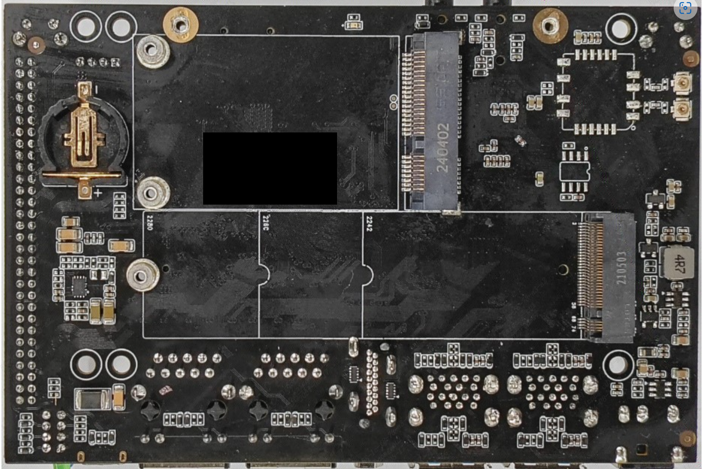
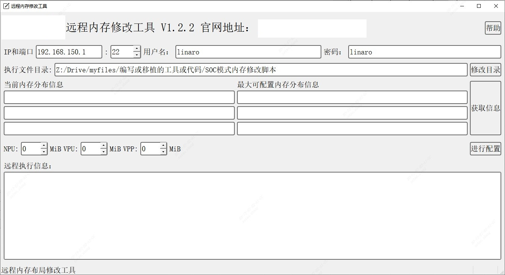
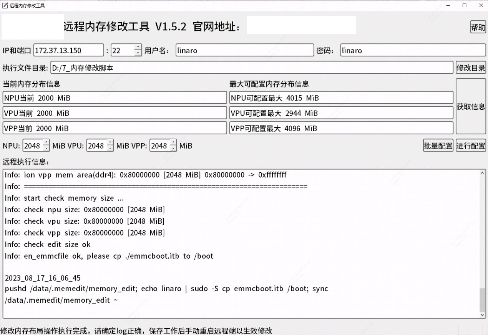

# So-dimm开发者套件使用手册

**修订记录**

| **版本号** | **修订日期** | **作者** | **修订内容** |
| --- | --- | --- | --- |
| **1.0** | **24.06.13** | **c. x.** | **初次制作** |
| **1.1** | **24.06.14** | **x.** | **增加网络配置** |
| **1.2** | **24.07.01** | **x.** | **增加多媒体能力测试** |
| **1.3** | **24.08.06** | **c.** | **修改串口线材线序说明** |
|     |     |     |     |

## 目录

- [第一章 前言](#前言)
    - [1.1 概述](#概述)
    - [1.2 适用对象](#适用对象)
    - [1.3 约定的符号、标志、专用语解释](#约定的符号标志专用语解释)
    - [1.4 缩略语](#缩略语)
    - [1.5 声明](#声明)
 - [第二章 规格](#规格)
    - [2.1 套件内容](#21-套件内容)
    - [2.2 功能参数指标](#22-功能参数指标)
        - [2.2.1 核心板算力指标](#221-核心板算力指标)
        - [2.2.2 底板接口概览](#222-底板接口概览)
        - [2.2.3 工作环境指标](#223-工作环境指标)
    - [2.3 外形接口](#23-外形接口)
        - [2.3.1 核心板](#231-核心板)
        - [2.3.2 套件](#232-套件)
    - [2.4 散热规格](#24-散热规格)
    - [2.5 底板电源适配器规格](#25-底板电源适配器规格)
 - [第三章 使用方法](#使用方法)
    - [3.1 系统升级](#31-系统升级)
        - [3.1.1 操作说明](#311-操作说明)
        - [3.1.2 操作步骤](#312-操作步骤)
    - [3.2 网络配置](#32-网络配置)
    - [3.3 ssh连接](#33-ssh连接)
        - [3.3.1 LAN口连接](#331-lan口连接)
        - [3.3.2 WAN口连接](#332-wan口连接)
    - [3.4 串口连接](#34-串口连接)
    - [3.5 内存空间分配及修改方法](#35-内存空间分配及修改方法)
 - [第四章 常用命令参考](#常用命令参考)
    - [4.1 说明](#41-说明)
    - [4.2 常用命令](#42-常用命令)
 - [第五章 应用开发](#应用开发)
    - [5.1 概述](#51-概述)
    - [5.2 C++应用](#52-c应用)
    - [5.3 Python应用](#53-python应用)
 - [第六章 性能测试](#性能测试)
    - [6.1 多媒体能力测试](#61-多媒体能力测试)
        - [6.1.1 数据准备](#611-数据准备)
        - [6.1.2 解码能力测试](#612-解码能力测试)
        - [6.1.3 编码能力测试](#613-编码能力测试)
    - [6.2 算力测试](#62-算力测试)

# 前言

## 概述

本文阐述So-dimm套件的电气特性、接口电路、结构尺寸以及应用环境等方面的信息。在本文档和其他相关文档的帮助下，应用开发者可快速理解So-dimm套件的硬件功能并进行相关验证工作。

## 适用对象

本文档主要适用于以下工程师:

● 单板硬件工程师

● 嵌入式软件开发工程师

● 单板测试工程师

● 测试工程师

## 约定的符号、标志、专用语解释

在本文中可能出现如下符号、标志，它们所代表的含义如下：

| 危险 | 表示有高度危险，如果不能避免，可能导致人员伤亡或严重伤害 |
| --- | --- |
| 警告 | 表示有中度或低度潜在危险，如果不能避免，可能导致人员轻微或中等伤害 |
| 注意 | 表示有潜在风险，如果忽视这部分文本，可能导致设备损坏、数据丢失、设备性能降低或不可预知的结果 |
| 防静电 | 防静电标识，表示静电敏感的设备或操作 |
| 当心触电 | 电击防护标识，标识高压危险，需做好防护 |
| &nbsp; 窍门 | 表示能帮助您解决某个问题或节省您的时间 |
| &nbsp; 说明 | 表示是正文的附加信息，是对正文的强调和补充 |

## 缩略语

| eMMC | Embedded Multimedia Card | 嵌入式多媒体控制器 |
| --- | --- | --- |
| JPU | JPEG Process Unit | JPEG处理单元 |
| I2C | Inter-integrated Circuit | 内部整合电路 |
| LPDDR | Low-power Double Data Rate | 低功耗双倍速 |
| PCIe | Peripheral Component Interconnect Express | 快捷外围部件互连标准 |
| RGMII | Reduced Gigabit Media Independent Interface | 精简的千兆比媒介独立接口 |
| VPP | Video Post Process | 视频后处理 |
| VPU | Video Process Unit | 视频处理单元 |

## 声明

Copyright ©️2024 SXXXXX科技有限公司

我们对本产品手册及其中的内容具有全部的知识产权。除非特别授权，禁止复制或向第三方分发。凡侵犯本公司版权等知识产权权益的行为，本公司保留依法追究其法律责任的权利。

本产品系列将有不断地更新迭代，我们将定期检查本产品手册中的内容，在后续的版本中将出现不可避免的修正、删减、补充。

我们保留在不事先通知的情况下进行技术改进、文档变更、产品改进升级、增加或减少产品型号和功能的权利。

# 规格

## 2.1 套件内容

本套件具体共包括：

智算模组So-dimm（核心板） \* 1

配套开发底板 \* 1

配套散热风扇 \* 1

micro USB接口串口线 \* 1

配套底板电源 \* 1

## 2.2 功能/参数指标

### 2.2.1 核心板算力指标

表2-1 So-dimm核心板算力指标

| **操作系统** | Ubuntu20.04或Linux系统V4.19以上 |
| --- | --- |
| **处理器** | 处理器<br><br>S20：8核ARM A53，1.6GHz主频<br><br>S20：6核ARM A53，1.6GHz主频 |
| **数据处理能力** | 支持FP32/FP16/INT8，可同时进行16路高清视频解码与智能分析 |
| **内存** | S20：8GB，S20：4GB<br><br>LPDDR4，位宽64bits<br><br>数据速率 4266Mbps |
| **存储** | eMMC 32GB |
| **视频解码和编码** | 解码：H.264 & H.265: 16路1080P @30fps，最大分辨率8192 \* 8192<br><br>编码：H.264 & H.265: 12路 1080P @30fps，最大分辨率8K |
| **图片编解码** | JPEG：1080P@480fps，最大分辨率32768\*32768 |

### 2.2.2 底板接口概览

表2-2 So-dimm套件底板接口表

| **电源** | DC 12V |
| --- | --- |
| **千兆网口** | 千兆以太网口\*2 |
| **WIFI&BT** | WFI6+BT5.0（选配) |
| **HDMI 2.0接口** | HDMI 2.0 out\*1 |
| **USB 3.0接口** | USB3.0\*4(含OTG口) |
| **SIM卡接口** | Micro SIM卡座\*1 |
| **TF存储卡接口** | TF卡座\*1 |
| **Minipcie接口** | 支持Minipcie接口的4G，5G，Lora，Zigbee模块 |
| **M.2接口** | 支持NVMe协议的SSD固态硬盘 |
| **Mipi CSI** | MIPI摄像头接口\*2 |
| **音频接口** | Line in\*1，Line out\*1 |
| **风扇接口** | 4PIN风扇接口，GND/12V/NC/PWM |
| **Debug接口** | Micro USB Debug调试串口\*1 |
| **按键** | Reset按键\*1，Recovery按键\*1 |
| **RTC** | CR1220纽扣电池 |
| **状态灯** | LED灯\*4，PWM,ALM,REG,SYS |
| **预留天线** | 预留4G,WIFI,BT天线 |
| **扩展接口** | MIPI CSI显示接口\*2， SPI\*1,SATA接口\*2， MIC接口\*1， Uart\*4， GPIO(复用)\*10， Speaker\*1， I2C\*2， I2S\*1， PCIE（SATA复用）\*1， CAN\*1， VCC3.3V\*1 |
| **产品尺寸** | 120\*79mm |

### 2.2.3 工作环境指标

表2-3 So-dimm套件运行环境

| **环境指标** | 规格  |
| --- | --- |
| **工作温度** | \-20℃ ~ +80℃ |
| **存储温度** | \-20℃ ～+85℃ |
| **工作湿度** | 5% ~ 90%，无凝露 |
| **存储湿度** | 5% ~ 90%，无凝露 |

## 2.3 外形/接口

### 2.3.1 核心板


图2-1 So-dimm模组正面


图2-2 So-dimm模组背面

### 2.3.2 套件


图2-3 So-dimm套件正面



图2-4 So-dimm套件背面


图2-5 So-dimm套件正面接口一览


图2-6 So-dimm套件背面接口一览

## 2.4 散热规格

套件使用时需接上配套风扇一起使用。

## 2.5 底板电源适配器规格

推荐值：

| 输入电压 | 最小值 | 正常值 | 最大值 |
| --- | --- | --- | --- |
| VDD | 10.4V | 12V | 14.4V |

# 使用方法

## 3.1 系统升级

### 3.1.1 操作说明

本套件支持文件替换、tftp刷机、MicroSD卡刷机等方式。

使用MicroSD卡刷机烧写整个固件的方式最为干净可靠。理论上只要您的套件硬件上没有损坏，就可以使用MicroSD卡进行刷机。

注意：使用MicroSD卡刷机会重写整个eMMC，您储存在eMMC的数据会全部丢失，请务必做好数据备份。

### 3.1.2 操作步骤

- 步骤1 佩戴防静电手环或腕带
- 步骤2 准备一张16GB以上的MicroSD卡和读卡器，将卡格式化为FAT32格式

A. 对于Linux系统，可以参考下面的命令格式化

a) df -h # 找到SD卡的序列号，例如 /dev/sdb1

b) sudo umount /dev/sdb1 # 解除SD卡挂载

c) sudo mkfs.vfat -F 32 /dev/sdb1 # 格式化SD卡为fat32格式

B. 对于Windows系统，可以使用DiskGenius等工具格式化

- 下载压缩包，找到固件升级包（例如SXXXXX-img/sdcard.tgz）将解压后的所有文件拷贝到MicroSD卡的根目录下
- 设备下电，将MicroSD卡插入设备上的卡槽，设备上电
- 等待设备升级完成，移除MicroSD卡，重启设备
- 结束


图3-1 SD卡格式化流程

## 3.2 网络配置

So-dimm开发者套件通过netplan配置网络。

Netplan是一个抽象网络配置生成器。用户只需用一个yaml文件即可配置各个网络接口。其配置文件位于/etc/netplan目录下，默认内容为：


图3-2 netplan默认配置

可以看到，这里eth0网卡使能了dhcp，可以动态获取IP地址；eth1网卡指定了静态地址。

Netplan常用的配置项包括：

表3-1 netplan常用配置项

| **配置项** | **说明** |
| --- | --- |
| dhcp4 | 是否自动分配地址 |
| address | IP地址/子网掩码位。 |
| gateway4 | 网关  |
| nameservers | DNS |

修改完成后，需要使用sudo netplan apply命令，保证修改生效。

需要注意：若修改涉及IP变动，推荐使用串口连接开发板进行修改，避免ssh连接状态下因为配置错误而无法找到IP。

## 3.3 ssh连接

### 3.3.1 LAN口连接

So-dimm套件LAN口配置了默认的IP，地址为：192.168.150.1。将网线一端插入So-dimm套件的LAN口，一端插入PC机的网口，并且将PC的IP配置到192.168.150网段下，即可ping通So-dimm设备。此时可以通过ssh linaro@192.168.150.1命令访问设备。

linaro用户的默认密码为linaro，root用户无密码，可以从linaro用户使用sudo -i命令进入。

### 3.3.2 WAN口连接

So-dimm套件WAN口可以自动从交换机获取IP。将网线一端插入So-dimm套件的WAN口，一端插入交换机，即可通过如下方式获取IP。

- 将HDMI一端插入So-dimm套件的HDMI口，一端接入显示器，可以在显示器上看到IP信息
- 使用串口连接So-dimm设备，用ip a、ifconfig等命令查看IP

获得IP后，可以通过ssh linaro@&lt;Your IP&gt;命令访问设备。

linaro用户的默认密码为linaro，root用户无密码，可以从linaro用户使用sudo -i命令进入。

## 3.4 串口连接

So-dimm开发者套件串口类型为TTL UART调试串口。通过调试串口，可以看到板子实时的内核日志，并且可以登录板卡。

需要注意：调试串口不能用于传输文件。

调试串口的波特率是115200bps，8位数据位，1位停止位，无校验，不带流控。

So-dimm开发者套件的调试串口物理上是一个MicroUSB接口，对应针脚是3.3V TTL电平的UART信号。使用时，可搭配套件中提供的线材，黑色线为地线，绿色线接串口板TX，白色线接串口板RX。

linaro用户的默认密码为linaro，root用户无密码，可以从linaro用户使用sudo -i命令进入。

## 3.5 内存空间分配及修改方法

内存默认采用LPDDR4，总容量为8GB和4GB 2个版本（可选配16GB）。


图3-4 So-dimm内存布局

对于其他需要根据实际调整硬件单元所用设备内存大小的情况，可以通过内存修改工具对TPU、VPU、VPSS的内存布局进行修改。

工具使用方法：

- 使用浏览器打开<https://SXXXXX-file.SXXXXX.cn/SXXXXX-prod-s3/drive/23/09/11/13/DeviceMemoryModificationKit.tgz>，下载最新的远程内存修改工具，选择“qt_mem_edit_V&lt;x.y.z&gt;.”文件。其中.exe文件适用于Windows系统，.AppImage适用于带有桌面环境的Linux系统
- Windows系统双击对应的程序即可执行，LInux系统需要使用chmod +x &lt;filename&gt;命令为其添加运行权限后才可运行。该程序正常运行时如下图：



图3-5 远程内存修改工具界面

- 在该程序中配置So-dimm套件ssh远程连接需要的IP、端口、用户名和密码
- 点击“修改目录”可以配置当前主机上存放修改内存的所有过程文件
- 点击“获取信息”，获取当前So-dimm套件NPU/VPU/VPP配置的内存大小信息和最大可配置的内存大小信息
- 根据实际需求来调整三个数字框，它们代表配置完成后各部分的内存大小。单位MB，十进制。需要注意，在So-dimm设备上，VPU部分的内存大小请设置为0
- 点击“进行配置”按钮，配置完成后，程序输出如下图：



图3-6 远程内存修改工具log

- 查看“远程执行信息”中是否有Error输出，如果没有错误输出，则可以登录So-dimm设备，保存设备上当前工作，重启设备使修改生效。

# 常用命令参考

## 4.1 说明

- 以下常用命令，部分需要root权限下键入执行，需要通过SSH访问设备登录。
- 以SSH方式登录设备，默认用户名为linaro，默认密码为linaro。

## 4.2 常用命令

表4-1 常用命令参考

| **命令** | **说明** |
| --- | --- |
| bm_get_basic_info | 用于获取设备基本信息，包括IP地址、MAC地址、系统开机时间、板卡温度、芯片结温，NPU使用率等。 |
| bm_version | 用于查看设备版本信息。 |
| bm_get_temperature | 用于获取设备温度信息，包括板卡温度、芯片结温等。 |
| bm_set_ip | 用于设置静态IP。 |
| bm_set_ip_auto | 用于设置动态IP。 |
| cat /factory/OEMconfig.ini | 用于获取产品信息，如SN等 |
| cat /sys/kernel/debug/ion/cvi_vpp_heap_dump/summary | 查看VPU/JPU/VPSS预留内存的情况 |
| cat /sys/kernel/debug/ion/cvi_npu_heap_dump/summary | 查看TPU预留内存的情况 |
| bm-smi | 查看TPU使用率 |

# 应用开发

## 5.1 概述

SXXXXX SDK是SXXXXX科技基于自主研发的深度学习处理器定制的深度学习SDK，涵盖了神经网络推理阶段所需的模型优化、高效支持能力，为深度学习应用开发和部署提供易用、高效的全栈式解决方案。

SXXXXX SDK包含tpu-mlir、libSXXXXX、SXXXXX-meida等基础工具包和SXXXXX-demo、SXXXXX-sail、SXXXXX-stream等高级工具包。在So-dimm开发者套件中，已经预装了libSXXXXX和SXXXXX-media的运行环境。其中，libSXXXXX提供了tpu驱动、bmlib（设备管理）、运行时环境（库文件、工具等）；SXXXXX-media主要基于FFMPEG、OPENCV等开源框架，适配底层硬件进行加速。

表6-1 SDK目录结构

| **文件夹名** | **说明** |
| --- | --- |
| SXXXXX-img | SoC模式安装包等 |
| SXXXXX-media | 支持SXXXXX设备硬件加速的多媒体库 |
| tpu-mlir | TPU编译器工具链 |
| tpu-perf | 模型性能和精度验证工具包 |
| SXXXXX-stream | 基于pipeline的高性能推理框架 |
| SXXXXX-demo | 针对单模型或单场景的综合例程 |
| SXXXXX-sail | 对底层接口进行C++/Python API封装的接口库 |
| isp-tools | ISP各个模块的参数调节 |
| doc | 各个模块的文档资料 |

## 5.2 C++应用

基于C++开发应用时，可以参考我们的SXXXXX-demo和SXXXXX-stream两个仓库。除了从SDK压缩包中获取之外，这两个仓库还开源到了github上。

其中，SXXXXX-demo仓库是针对单个模型或单个场景的，从搭建环境、编译模型到获取推理结果进行全面引导的仓库。其中大部分模型都包含了基于C++和Python语言的例程。用户可以参考其中的C++代码，梳理解码、预处理、推理、后处理的流程，同时起到熟悉bmlib、bmcv接口的作用。

SXXXXX-stream是一个基于C++开发的低代码高性能推理框架。该框架包含了编解码、http协议上报、绘图、常见的检测/分类/姿态识别/OCR模型、图像拼接、深度估计等模块，用户可以通过配置Json文件搭建起pipeline，针对图片、视频、码流、相机等输入并行地进行推理，并基于框架提供的功能实现结果上报。

## 5.3 Python应用

基于Python开发应用时，可以参考我们的SXXXXX-demo和SXXXXX-sail两个仓库。SXXXXX-demo仓库如上文所述，已经开源到github。SXXXXX-sail目前只能通过SDK压缩包获取。

SXXXXX-sail是基于Python开发应用的核心模块，它对bmlib、bmcv、ffmpeg等代码库进行了封装，并基于pybind对外提供Python接口。SXXXXX-sail包含解码、常见图像处理、Tensor操作、推理等功能，可以搭建起完整的Python应用。

需要注意，So-dimm套件上默认没有安装SXXXXX-sail的Python环境，需要从SDK目录下的SXXXXX-sail/python_wheels/soc_S20/目录获取相应版本的Python whl，并在开发板上使用 pip3 install xxx.whl 命令安装。

安装完成后，可以使用 import SXXXXX.sail as sail 命令来验证是否安装成功。

基于Python开发应用，可以参考SXXXXX-demo仓库中各模型目录下的python例程，也可以参考SXXXXX-sail源码目录中的sample/python目录。此目录中提供了视频编解码、yolov5/resnet等常见模型推理的参考代码。

# 性能测试

## 6.1 多媒体能力测试

### 6.1.1 数据准备

执行以下命令，下载数据：

```bash
pip3 install dfss --force-reinstall
python3 -m dfss --url=open@sxxxxx.com:test/video_decode_encode_test/data.tgz
python3 -m dfss --url=open@sxxxxx.com:test/video_decode_encode_test/scripts.tgz
```

下载的内容包括：

```bash
.data

├── 1080p-3Mbps-h264.mkv # 1080p 3Mbps码率 h264视频
├── 1080p-3Mbps-hevc.mkv # 1080p 3Mbps码率 h265视频
├── 4k-4Mbps-h264.mkv # 4k 4Mbps码率 h264视频
├── 4k-4Mbps-hevc.mkv # 4k 4Mbps码率 h265视频
├── 720p-2Mbps-h264.mkv # 720p 2Mbps码率 h264视频
├── 720p-2Mbps-hevc.mkv # 720p 2Mbps码率 h265视频
├── 8k-8Mbps-h264.mkv # 8k 8Mbps码率 h264视频
├── 8k-8Mbps-hevc.mkv # 8k 8Mbps码率 h265视频
└──test.264 # 转码测试文件

.scripts
├── 4k-8k-decode.sh # 4k、8k视频解码
├── 4k-8k-encode.sh # 4k、8k视频编码
├── decode.sh # 解码测试脚本
├── encode.sh # 编码测试脚本
├── transcode-1Mbps.sh # 转码1Mbps测试脚本
└── transcode-32kbps.sh # 转码32kbps测试脚本
```

### 6.1.2 解码能力测试

使用1080P视频测试解码能力，需要指定输入的视频、使用的tpu id（SoC形态上，只能输入0）、测试线程数。

以1080P视频、0号TPU、16线程为例：

```bash
$ bash decode.sh

video：1080p-3Mbps-h264.mkv

tpu_id:0

thread_num:16

Start Wait End...

nohup: redirecting stderr to stdout ...

Start Calc fps...

tpu_id: 0

total_frames: 14400

avg_time: 19.3676

speed: 743.51
```

如上，可以看到总共16个线程，总的解码速度为743.51fps。可以保证16路1080P数据30fps的解码。

### 6.1.3 编码能力测试

使用1080P视频测试编码能力，需要指定输入的视频、使用的tpu id（SoC形态上，只能输入0）、测试线程数。

以1080P视频、0号TPU、12线程为例：

```bash
$ bash encode.sh

video：1080p-3Mbps-h264.mkv

tpu_id:0

thread_num:12

encode_type(h264_bm / hevc_bm):h264_bm

nohup: redirecting stderr to stdout

Start Wait End... ...

Start Calc fps...

tpu_id: 0

total_frames: 10800

avg_time: 29.5306

speed: 365.72
```

如上，可以看到总共12个线程，总的编码速度为365.72fps。可以保证12路1080P数据30fps的编码。

## 6.2 算力测试

待补充
