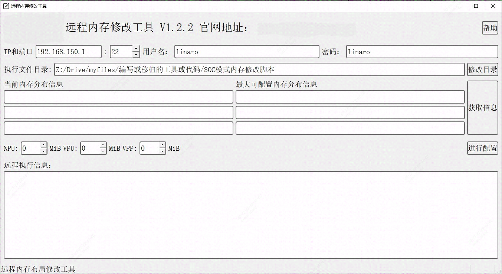

## 3.5 内存空间分配及修改方法

内存默认采用LPDDR4，总容量为8GB和4GB 2个版本（可选配16GB）。

图3-4 SM9内存布局

对于其他需要根据实际调整硬件单元所用设备内存大小的情况，可以通过内存修改工具对TPU、VPU、VPSS的内存布局进行修改。

工具使用方法：

- 使用浏览器打开<https://sophon-file.sophon.cn/sophon-prod-s3/drive/23/09/11/13/DeviceMemoryModificationKit.tgz>，下载最新的远程内存修改工具，选择“qt_mem_edit_V&lt;x.y.z&gt;.”文件。其中.exe文件适用于Windows系统，.AppImage适用于带有桌面环境的Linux系统
- Windows系统双击对应的程序即可执行，LInux系统需要使用chmod +x &lt;filename&gt;命令为其添加运行权限后才可运行。该程序正常运行时如下图：

图3-5 远程内存修改工具界面

- 在该程序中配置SM9套件ssh远程连接需要的IP、端口、用户名和密码
- 点击“修改目录”可以配置当前主机上存放修改内存的所有过程文件
- 点击“获取信息”，获取当前SM9套件NPU/VPU/VPP配置的内存大小信息和最大可配置的内存大小信息
- 根据实际需求来调整三个数字框，它们代表配置完成后各部分的内存大小。单位MB，十进制。需要注意，在SM9设备上，VPU部分的内存大小请设置为0
- 点击“进行配置”按钮，配置完成后，程序输出如下图：

图3-6 远程内存修改工具log

- 查看“远程执行信息”中是否有Error输出，如果没有错误输出，则可以登录SM9设备，保存设备上当前工作，重启设备使修改生效。